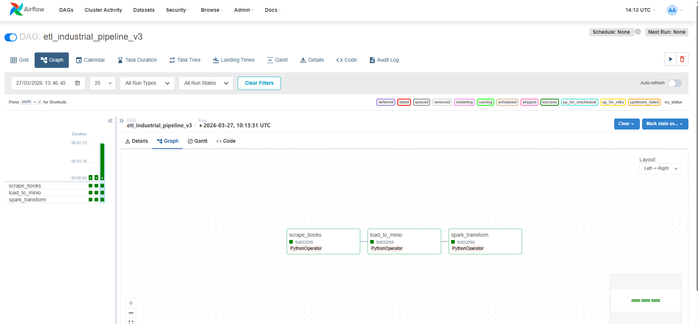
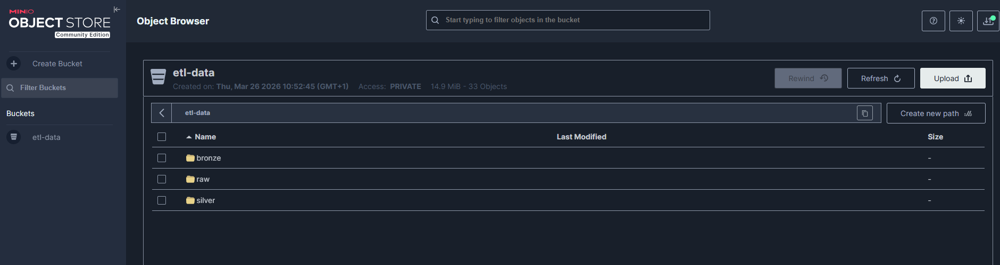
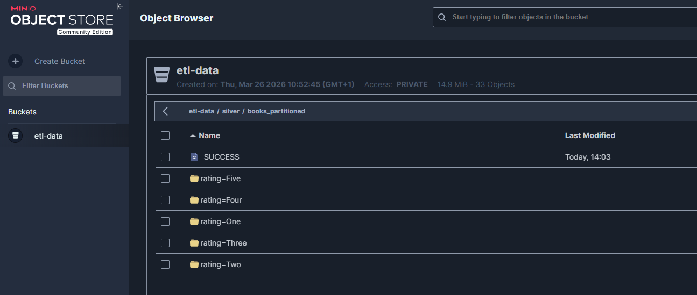

# 📚 ETL Industrial Books Pipeline

Pipeline ETL industriel complet automatisant la collecte, la transformation et le stockage de données hétérogènes.

## 🏗️ Architecture du Projet
- **Sources :** 1. **Web Scraping** : Extraction dynamique (BeautifulSoup) depuis `books.toscrape.com`.
    2. **Fichiers Structurés** : Ingestion de fichiers CSV (données historiques).
    3. **Base de Données SQL** : Jointure avec un référentiel PostgreSQL (`ref_categories`) pour enrichir les données.
- **Orchestration :** Airflow (Dockerisé)
- **Traitement :** PySpark
- **Stockage :** MinIO (Data Lake) & PostgreSQL (Data Warehouse)

## 🛠️ Installation & Utilisation
1. Lancer l'infrastructure : `docker-compose up -d`
2. Accéder à Airflow (`localhost:8080`) et activer le DAG `etl_industrial_pipeline_v3`.

### 🟢 Orchestration avec Airflow
Le pipeline est entièrement automatisé. Chaque étape (Extraction, Load, Transformation) est supervisée et validée.



## 🔍 Qualité des Données & Validation
Le script Spark intègre des mécanismes de résilience pour traiter les données "sales" :
- **Suppression des résidus binaires** : Élimination des octets nuls (`\x00`).
- **Typage dynamique** : Conversion automatique des prix en format numérique `Double`.
- **Lignage (Lineage)** : Organisation par dossiers temporels (Year/Month/Day).



## 📂 Optimisation du Stockage (Critère 4.1)
Les données transformées sont stockées dans le Data Lake (MinIO) au format **Parquet**. Nous utilisons le **partitionnement par `rating`** pour optimiser les performances de lecture.



## 📊 Exploitation des Données (SQL)
Une fois les données chargées dans le Data Warehouse (PostgreSQL), elles sont prêtes pour l'analyse :

```sql
SELECT 
    count(*) as total_livres, 
    round(avg(price_gbp)::numeric, 2) as prix_moyen 
FROM dim_books;
```
🧪 Qualité du Code & Tests (Critère 4.2)
Le projet suit les standards industriels avec une suite de tests automatisés.

Outil : Pytest / Pytest-cov

Score final : 98% de couverture

Rapport détaillé :
```
Name                           Stmts   Miss  Cover
--------------------------------------------------
src/extract/extract_csv.py       17      1    94%
src/utils/config.py              14      0   100%
src/utils/logger.py              15      0   100%
--------------------------------------------------
TOTAL                            46      1    98%
```

Validation des données (CLI) : > Bien que les captures d'écran confirment le succès visuel, l'intégrité du partitionnement Silver (rating=Five, etc.) a été validée via le client mc de MinIO pour garantir la structure physique des fichiers Parquet.
```
docker exec minio mc ls -r myminio/etl-data/silver/books_partitioned
```

Projet réalisé pour démontrer des compétences en architecture de données et automatisation de pipelines industriels.

